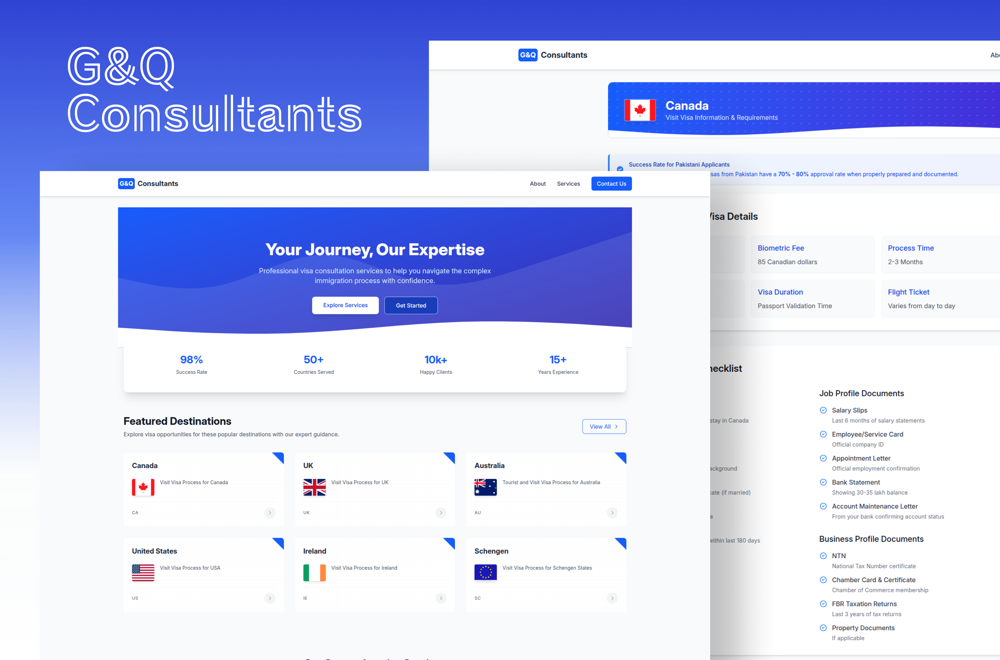

# GQ Consultants

 


## Introduction

GQ Consultants is a web-based application designed to simplify visa and immigration consultancy services. The platform allows users to explore visa application processes, access country-specific information, learn about the consultancy’s history, and connect through a contact form. With a focus on user experience, responsiveness, and modern design practices, GQ Consultants offers a seamless and professional digital experience.

The project reflects the legacy of GQ Consultants, a trusted name in visa and immigration consultancy since 2015, by offering a digital solution that mirrors their commitment to excellence.


## Features

- **Dynamic Multi-page Navigation**: Includes routes for Home, About, Services, and Contact.
- **Country-specific Visa Information**: Offers detailed visa application processes for countries like Canada, UK, USA, and Australia.
- **Responsive Design**: Ensures compatibility with all devices, including support for dark mode.
- **Contact Form**: Allows users to send inquiries directly to the consultancy.
- **Error Handling**: Built-in error boundary to gracefully handle unexpected issues and enhance user experience.
- **Theming**: TailwindCSS-based dark mode and responsive design for accessibility.


## Technologies Used

### **Languages**
- **TypeScript**: Ensures type safety and maintainability of the codebase.
- **HTML & CSS**: Used for structuring and additional styling of components.

### **Frameworks and Libraries**
- **React**: For building modular and reusable UI components.
- **React Router**: For client-side routing and navigation.
- **TailwindCSS**: For responsive and utility-first styling.

### **Other Tools**
- **Google Fonts**: Fonts are preloaded for optimized performance.
- **Node.js**: Utilized for package management, build tools, and running the development server.


## Setup and Installation

Follow these steps to set up the project locally:

1. **Clone the Repository**:
   ```bash
   git clone https://github.com/AbdullahButt2611/GQ-Consultants.git
   ```
2. **Navigate to the Project Directory**:
   ```bash
   cd GQ-Consultants
   ```
3. **Install Dependencies**:
   ```bash
   npm install
   ```
4. **Start the Development Server**:
   ```bash
   npm run dev
   ```
5. **Access the Application**:
   Open your browser and navigate to:
   ```
   http://localhost:3000
   ```


## Usage

1. **Home Page**: Provides a brief introduction to GQ Consultants.
2. **About Page**: Shares the consultancy's history and vision.
3. **Services Page**: Details the visa and immigration consultancy services offered.
4. **Contact Page**: Enables users to fill out a contact form for inquiries.
5. **Country-specific Pages**: Display visa application details for various countries, including Canada, the UK, USA, and more.


## Potential Use Cases

1. **Visa and Immigration Consultancy Firms**: Showcase services, country-specific visa details, and connect with clients.
2. **Educational Consultancies**: Assist students with study-abroad programs by extending the platform to include universities and scholarships.
3. **Government or NGOs**: Provide immigration assistance and share procedural guidelines for visa applications.
4. **Travel Agencies**: Streamline visa application processes as part of travel packages.
5. **General Information Systems**: Adapt the platform for other data-driven services, such as event management or tourism information.


## Deployed Version

A live version of this project can be accessed here:
[G&Q Consultants](https://gq-consultants.vercel.app/) <!-- Replace # with the actual URL -->


## Contact

For inquiries or feedback, feel free to reach out:

- **Developer**: Abdullah Butt
- **Email**: [abutt2210@gmail.com]
- **GitHub Profile**: [AbdullahButt2611](https://github.com/AbdullahButt2611)
